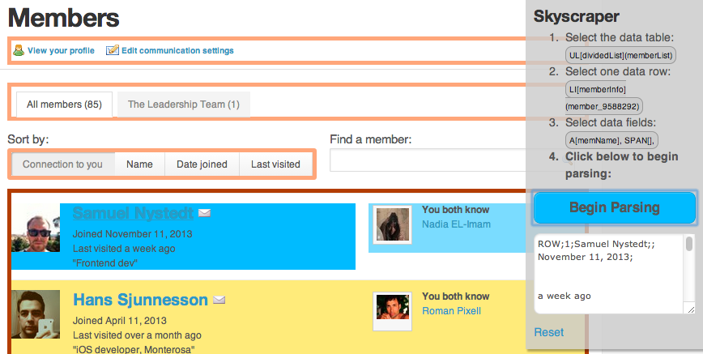

# Skyscraper.JS

Skyscraper.JS - an interactive web scraping bookmarklet.

## How to Use

1. Once installed, you have a little bookmarklet in your browser.
2. Click it and it will identify tables and lists (UL, OL) in the current web page.
3. Click a table to select it.
4. Click a data row to identify what is a row.
5. Click as many data fields as you want.
6. Press 'Begin Parsing' to start the parse.

## How to Run

1. Start a webserver in this directory on port 8000 *, e.g. `python -m SimpleHTTPServer` on a Mac.
2. Open the demo page on http://localhost:8000

*The host name 'localhost:8000' is used both in index.html and in the CSS file, please change to your own host name.